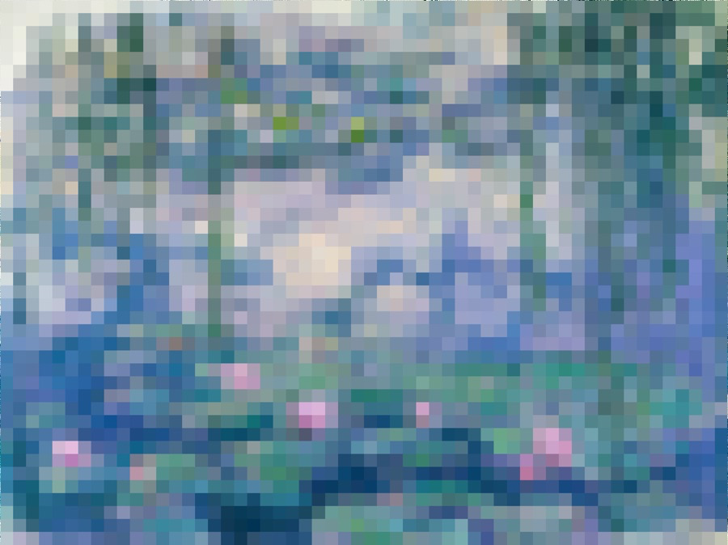

# Optometry tests for glasses

Author: Haomin Wang (haominw)

Note: Due to on-site interviews and midterm, I did not have time to implement this game:(

Design: You need a new pair of glasses, so you came to an optician to conduct optometry tests. While the optician is adjusting the experimental glasses, you need to tell the optician whether the image is becoming clearer or more blurred. The optician will know when the optimal level is reached.

Screen Shot:

How To Play:

Press UP/DOWN to let the optician know the image you see is getting better/worse. Once you are done with the current image, a new image will be provided to make sure the parameters for your glasses are accurate. The optometry tests end once you have gone through 5 images.

Sources:
I planned to use paintings by Oscar-Claude Monet.
(The author died in 1926, so according to US copyright laws, his work is in public domain.)

This game was built with [NEST](NEST.md).
